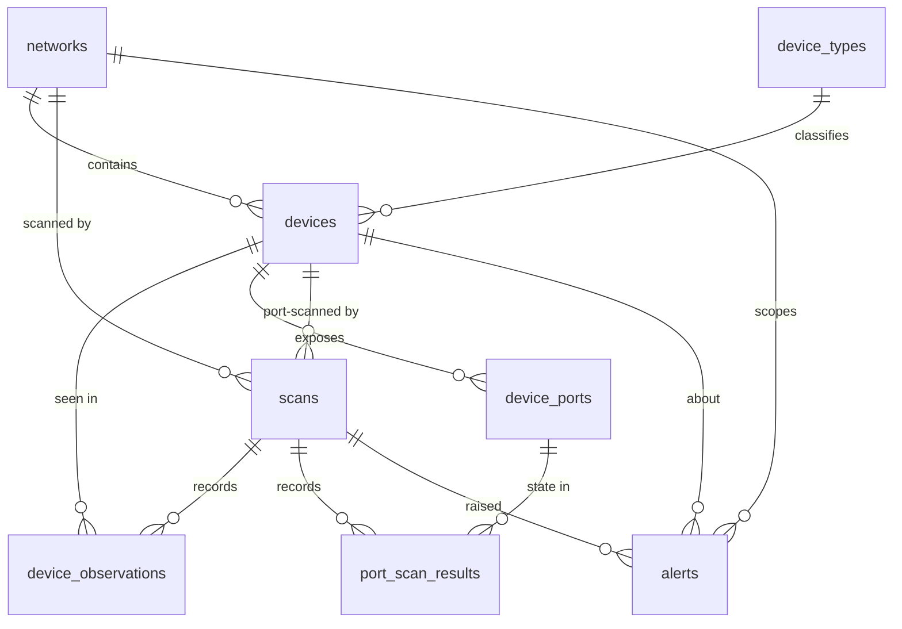

# NetScope Database

> Status: **Step 2 — schema implemented.** Source of truth:
> [`server/src/db/migrations/`](../server/src/db/migrations/).

## 1. Role

PostgreSQL (16+) is the **system of record**: networks, the device inventory, every scan that ran,
what each scan observed, open ports, and alerts. It is not used as a queue or a cache.

## 2. Conventions

- `snake_case`, plural table names. Constraints and indexes are named `<table>_<purpose>_{key,idx}`.
- Primary keys: `uuid DEFAULT gen_random_uuid()` for entities the API exposes; `bigint` identity
  for high-volume, append-only result tables.
- Every timestamp is `timestamptz`. Mutable tables have `created_at` and `updated_at`, and a
  shared trigger (`set_updated_at`) keeps `updated_at` current. Append-only tables have `observed_at`.
- **Native network types:** `inet` (IP), `cidr` (subnet), `macaddr` (MAC). They validate on write,
  normalize formatting (`A4-83-E7-…` is stored as `a4:83:e7:…`), and support subnet operators (`ip << cidr`).
- **Closed sets that code depends on** (statuses, scan types, alert types) use `CHECK` constraints.
  **Open, user-facing categories** (device types) use a lookup table, so adding one is an `INSERT`.
- `jsonb` only for genuinely variable data (`scans.params`, `alerts.context`), constrained to objects.
- Every foreign key states its `ON DELETE` behaviour. Foreign key columns used for joins and
  cascades are indexed. `devices.device_type` is not, because lookup rows are never deleted.
- Invariants live in the database as well as in code: the gateway must be inside its subnet, a
  finished scan must have `finished_at`, at most one scan may be active, and so on.
- **All SQL lives in `server/src/db/`** (repositories from Step 3) and uses parameterized queries
  (`$1, $2`), never string interpolation.

## 3. Schema

The schema follows one pattern:

| Kind                                 | Tables                                     | Nature                                    |
| ------------------------------------ | ------------------------------------------ | ----------------------------------------- |
| **Current state**: what is true now  | `networks`, `devices`, `device_ports`      | Mutable; updated as scans report          |
| **Scan results**: what each scan saw | `device_observations`, `port_scan_results` | Append-only history, one row per scan hit |
| **Runs and events**                  | `scans`, `alerts`                          | One row per run / per notable change      |
| **Lookup**                           | `device_types`                             | Seeded, extensible                        |

There is no single generic `scan_results` table. A discovery result ("device X was at IP Y,
latency Z") and a port result ("port P on device X was open") have different shapes. One table
would need nullable columns or untyped JSON, so each scan type writes to its own typed result table.

| Table                 | Purpose                                                          | Key constraints                                                                                   |
| --------------------- | ---------------------------------------------------------------- | ------------------------------------------------------------------------------------------------- |
| `networks`            | A monitored LAN (the same laptop can join several)               | Unique `(gateway_mac, cidr)`; gateway inside `cidr`; IPv4 only                                    |
| `device_types`        | Device categories (`router`, `phone`, `printer`, …)              | Code format check; 16 seeded rows                                                                 |
| `devices`             | Current state of each device                                     | Unique `(network_id, mac_address)`; host IPv4 only; type FK                                       |
| `scans`               | One row per scan run (`discovery` or `port`)                     | **One active scan** (partial unique index); status/timestamp invariants; port scans need a device |
| `device_observations` | Discovery results: device seen by a scan, with its IP then       | Unique `(scan_id, device_id)`                                                                     |
| `device_ports`        | TCP ports ever found open on a device                            | Unique `(device_id, protocol, port)`; port 1–65535; TCP only                                      |
| `port_scan_results`   | Port results: state of a known port in one scan                  | Unique `(scan_id, device_port_id)`; state `open`/`closed`/`filtered`                              |
| `alerts`              | Notable changes (new device, offline, IP changed, new open port) | Type/severity checks; SET NULL on device/scan delete to keep history                              |

### Indexes

| Index                                                                | Serves                                              |
| -------------------------------------------------------------------- | --------------------------------------------------- |
| `devices_network_mac_key` (unique)                                   | Discovery matching by MAC; per-network device lists |
| `devices_network_status_idx`                                         | Online/offline counts and filters                   |
| `devices_network_first_seen_idx`                                     | "New devices in the last 24 h"                      |
| `devices_network_ip_idx`                                             | Looking up a device by current IP                   |
| `scans_single_active_idx` (partial unique)                           | Enforces one queued/running scan                    |
| `scans_network_created_idx`                                          | Scan history per network                            |
| `scans_target_device_created_idx` (partial)                          | Latest port scan for a device                       |
| `device_observations_device_observed_idx`                            | Device presence / IP timeline                       |
| `port_scan_results_port_observed_idx`                                | Port state history                                  |
| `alerts_open_idx` (partial)                                          | Unacknowledged alerts (inbox, badge count)          |
| `alerts_network_created_idx`, `alerts_device_idx`, `alerts_scan_idx` | Alert history; FK lookups                           |

## 4. Device identity

Discovery repeatedly answers one question: **is this the same device we saw before?**

| Field                                 | Stable?          | Role                                                                                                                                      |
| ------------------------------------- | ---------------- | ----------------------------------------------------------------------------------------------------------------------------------------- |
| `id` (uuid)                           | ✅ Permanent     | Internal reference used by the API, URLs, and foreign keys. Never changes, even if matching rules change later.                           |
| `network_id` + `mac_address`          | ✅ Natural key   | **How discovery matches a device.** The MAC is the hardware (or per-network private) address, the only identifier every LAN host reveals. |
| `mac_is_random`                       | Derived          | True for locally administered (randomized) MACs. Generated from the MAC, so it can never disagree with it.                                |
| `ip_address`                          | ❌ Changes       | DHCP reassigns IPs, and an IP can later belong to another device. Latest value on `devices`; history in `device_observations`.            |
| `hostname`                            | ❌ Changes       | Optional, user-configurable, not unique. Latest value plus per-scan history.                                                              |
| `vendor`                              | Derived          | From the MAC's OUI prefix. Unknown for randomized MACs.                                                                                   |
| `device_type`                         | ❌ Changes       | Inferred or set by the user.                                                                                                              |
| `status`                              | ❌ Changes       | `online` / `offline`, recalculated after each discovery scan.                                                                             |
| `first_seen_at`                       | ✅ Set once      | When the device first appeared. Drives "new device" detection.                                                                            |
| `last_seen_at`                        | ❌ Moves forward | Last scan that saw the device.                                                                                                            |
| `display_name`, `notes`, `is_trusted` | User-owned       | Never overwritten by scans.                                                                                                               |

**Why MAC, scoped per network:**

- The IP cannot be the identity: DHCP moves devices between addresses and hands old addresses to new devices.
- Modern phones and laptops use a **private MAC per Wi-Fi network**. It is stable on that network
  but different on every other one, so identity must be per network. The same phone at home and at
  the office is two device rows, one on each network.
- Known limit: when a device regenerates its private MAC (factory reset, "rotating" privacy mode, or
  "forget network"), it appears as a new device. `mac_is_random` lets the UI explain this, and a
  future "merge devices" action can combine the two rows. Stable `uuid` references make that possible.
- `mac_address` is `NOT NULL`: a host on the local subnet that never resolved to a MAC cannot be
  identified reliably, so it is not recorded as a device.

## 5. Migrations

- Tool: [node-pg-migrate](https://github.com/salsita/node-pg-migrate), using **plain SQL files** with
  `-- Up Migration` / `-- Down Migration` sections, in `server/src/db/migrations/`.
- Each migration runs in its own transaction under an advisory lock (no concurrent runs).
- Applied migrations are recorded in the `pgmigrations` table.
- Migrations run explicitly (`npm run db:migrate`), never automatically on server start. At startup
  the server logs a warning if any are pending.
- Never edit a migration that has been applied anywhere; add a new one instead.

| Command                                         | Effect                                 |
| ----------------------------------------------- | -------------------------------------- |
| `npm run db:migrate`                            | Apply all pending migrations           |
| `npm run db:migrate:down`                       | Revert the most recent migration       |
| `npm run db:migrate:status`                     | List applied and pending migrations    |
| `npm run db:migrate:create -w server -- <name>` | Create a new timestamped SQL migration |

## 6. Connection management

- One `pg.Pool` per process (`server/src/db/pool.js`), configured from `DATABASE_*` variables,
  with a connection timeout, a server-side `statement_timeout`, and `application_name=netscope-server`.
- `query()` and `withTransaction()` convert driver errors into API errors: connection problems →
  `503 DATABASE_UNAVAILABLE`, unique violations → `409 CONFLICT`. Anything else surfaces as a 500 bug.
- If PostgreSQL restarts, the pool drops dead connections and reconnects on next use; the API
  stays up and `/api/health` returns 503 until the database is back.
- Graceful shutdown closes the HTTP server first, then drains the pool.
- `DATABASE_URL` holds credentials. It is passed only to the driver: it is never logged (logs show
  host, port, and database name only) and never returned in any response.

## 7. Testing

`npm test` uses a separate database from `TEST_DATABASE_URL` (the name must end in `_test`; the
setup refuses anything else because tests truncate tables). Migrations are applied to it
automatically before the suite runs.

## 8. Growth and retention

`device_observations` grows by roughly devices × scans: 50 devices scanned every 5 minutes is
about 14k rows/day, which is small for PostgreSQL. A retention purge (`DATA_RETENTION_DAYS`)
arrives with scheduled scans in Step 9.
