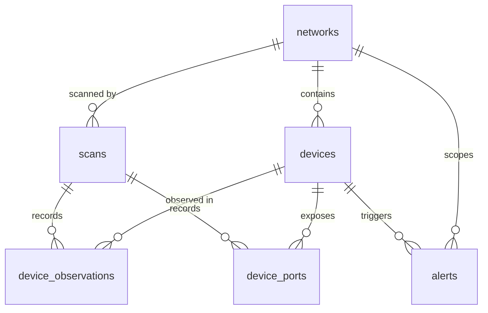

# NetScope Database

> Status: **Step 1 — conceptual design only.** No tables exist yet. Step 2 sets up the connection,
> migrations, and the core schema. Later tables arrive with the feature that needs them.

## 1. Role

PostgreSQL is the **system of record**: the device inventory, every scan that ran, what each scan
observed, open ports, and alerts. It is not used as a queue or a cache.

## 2. Conventions

- `snake_case`, plural table names (`devices`, `scans`).
- Primary keys: `uuid DEFAULT gen_random_uuid()`. High-volume append-only tables use `bigint` identity.
- All timestamps are `timestamptz` (stored UTC). Mutable tables have `created_at` and `updated_at`.
- **Native network types:** `inet` for IPs, `cidr` for subnets, `macaddr` for MAC addresses. They
  validate on write, normalize formatting, and support operators such as `ip << '192.168.1.0/24'`.
- Enumerations are `text` with `CHECK` constraints (easier to evolve than PostgreSQL enums).
- `jsonb` only for genuinely variable data (scan parameters, alert context).
- Foreign keys always state `ON DELETE` behaviour explicitly.
- **All SQL lives in repositories** and uses parameterized queries (`$1, $2`), never string interpolation.
- **Migrations** (node-pg-migrate, plain SQL) live in `server/src/db/migrations/`, run with
  `npm run db:migrate`, are forward-only in production, and are never edited once applied.

## 3. Entity overview

## 4. Planned tables

### `networks` _(Step 2 schema, used from Step 3)_

A monitored LAN. A laptop moves between networks, so the inventory is scoped per network.

| Column                          | Type        | Notes                                     |
| ------------------------------- | ----------- | ----------------------------------------- |
| `id`                            | uuid PK     |                                           |
| `name`                          | text        | User-editable ("Home", "Office")          |
| `cidr`                          | cidr        | e.g. `192.168.1.0/24`                     |
| `gateway_ip`                    | inet        |                                           |
| `gateway_mac`                   | macaddr     | Distinguishes two LANs with the same CIDR |
| `interface_name`                | text        | e.g. `en0`                                |
| `first_seen_at`, `last_seen_at` | timestamptz |                                           |

Unique: `(gateway_mac, cidr)`.

### `devices` _(Step 2 schema, populated in Step 3)_

The current state of each known device.

| Column                          | Type        | Notes                                              |
| ------------------------------- | ----------- | -------------------------------------------------- |
| `id`                            | uuid PK     |                                                    |
| `network_id`                    | uuid FK     | → `networks`, `ON DELETE CASCADE`                  |
| `mac_address`                   | macaddr     | Stable identity on the LAN                         |
| `ip_address`                    | inet        | Latest known IP (DHCP can change it)               |
| `hostname`                      | text        | Reverse DNS / mDNS when available                  |
| `vendor`                        | text        | From the MAC OUI prefix                            |
| `display_name`                  | text        | User-assigned _(Step 6)_                           |
| `device_type`                   | text        | `unknown`, `router`, `computer`, `phone`, `iot`, … |
| `is_trusted`                    | boolean     | User-marked known device                           |
| `notes`                         | text        | _(Step 6)_                                         |
| `status`                        | text        | `online` \| `offline`                              |
| `first_seen_at`, `last_seen_at` | timestamptz | `first_seen_at` drives "new device" logic          |
| `created_at`, `updated_at`      | timestamptz |                                                    |

Unique: `(network_id, mac_address)`. Indexes: `(network_id, status)`, `(network_id, last_seen_at DESC)`.
Note: phones use per-network private (randomized) MACs. These are stable within a network, so
per-network identity still works, but a factory reset or a setting change appears as a new device.

### `scans` _(Step 2 schema, used from Step 3)_

| Column                        | Type        | Notes                                                           |
| ----------------------------- | ----------- | --------------------------------------------------------------- |
| `id`                          | uuid PK     |                                                                 |
| `network_id`                  | uuid FK     | → `networks`                                                    |
| `type`                        | text        | `discovery` \| `port`                                           |
| `status`                      | text        | `queued` \| `running` \| `completed` \| `failed` \| `cancelled` |
| `trigger`                     | text        | `manual` \| `scheduled`                                         |
| `target`                      | text        | CIDR (discovery) or IP (port scan)                              |
| `params`                      | jsonb       | Exact parameters used (ports, timeouts) for auditability        |
| `hosts_found`                 | integer     | Summary                                                         |
| `error_code`, `error_message` | text        | When failed                                                     |
| `started_at`, `finished_at`   | timestamptz |                                                                 |
| `created_at`                  | timestamptz |                                                                 |

Index: `(network_id, created_at DESC)`.

### `device_observations` _(Step 2 schema, written in Step 3, read in Step 9)_

One row per device per discovery scan: the raw material for history and uptime.

| Column        | Type            | Notes                            |
| ------------- | --------------- | -------------------------------- |
| `id`          | bigint identity |                                  |
| `scan_id`     | uuid FK         | → `scans`, `ON DELETE CASCADE`   |
| `device_id`   | uuid FK         | → `devices`, `ON DELETE CASCADE` |
| `ip_address`  | inet            | IP at observation time           |
| `latency_ms`  | real            | When measured                    |
| `observed_at` | timestamptz     |                                  |

Index: `(device_id, observed_at DESC)`. Volume: 50 devices × a scan every 5 minutes ≈ 14k rows/day,
which is small for PostgreSQL. `DATA_RETENTION_DAYS` purges old rows _(Step 9)_.

### `device_ports` _(Step 7)_

| Column        | Type            | Notes                                |
| ------------- | --------------- | ------------------------------------ |
| `id`          | bigint identity |                                      |
| `scan_id`     | uuid FK         | → `scans`                            |
| `device_id`   | uuid FK         | → `devices`                          |
| `port`        | integer         | `CHECK (port BETWEEN 1 AND 65535)`   |
| `protocol`    | text            | `tcp`                                |
| `state`       | text            | `open` \| `closed` \| `filtered`     |
| `service`     | text            | Well-known service name for the port |
| `observed_at` | timestamptz     |                                      |

Index: `(device_id, scan_id)`.

### `alerts` _(Step 10)_

| Column            | Type        | Notes                                                                                    |
| ----------------- | ----------- | ---------------------------------------------------------------------------------------- |
| `id`              | uuid PK     |                                                                                          |
| `network_id`      | uuid FK     |                                                                                          |
| `device_id`       | uuid FK     | Nullable, `ON DELETE SET NULL`                                                           |
| `type`            | text        | `new_device` \| `device_offline` \| `device_returned` \| `ip_changed` \| `new_open_port` |
| `severity`        | text        | `info` \| `warning` \| `critical`                                                        |
| `title`           | text        |                                                                                          |
| `context`         | jsonb       | Rule-specific data (old/new IP, port)                                                    |
| `acknowledged_at` | timestamptz | Null = open                                                                              |
| `created_at`      | timestamptz |                                                                                          |

Index: `(network_id, acknowledged_at, created_at DESC)`.

### Reports _(Step 11)_

Generated on demand from the tables above and streamed to the client. No table is needed unless
scheduled or archived reports are added.

## 5. Step 2 scope

1. Connection pool (`pg`) configured from `DATABASE_URL`, closed on shutdown.
2. Migration tooling (`db:migrate`, `db:migrate:down`, `db:migrate:create`).
3. Core schema: `networks`, `devices`, `scans`, `device_observations`.
4. `/api/health` reports database status (503 when unreachable).
5. A repository pattern example with tests against a dedicated test database.
